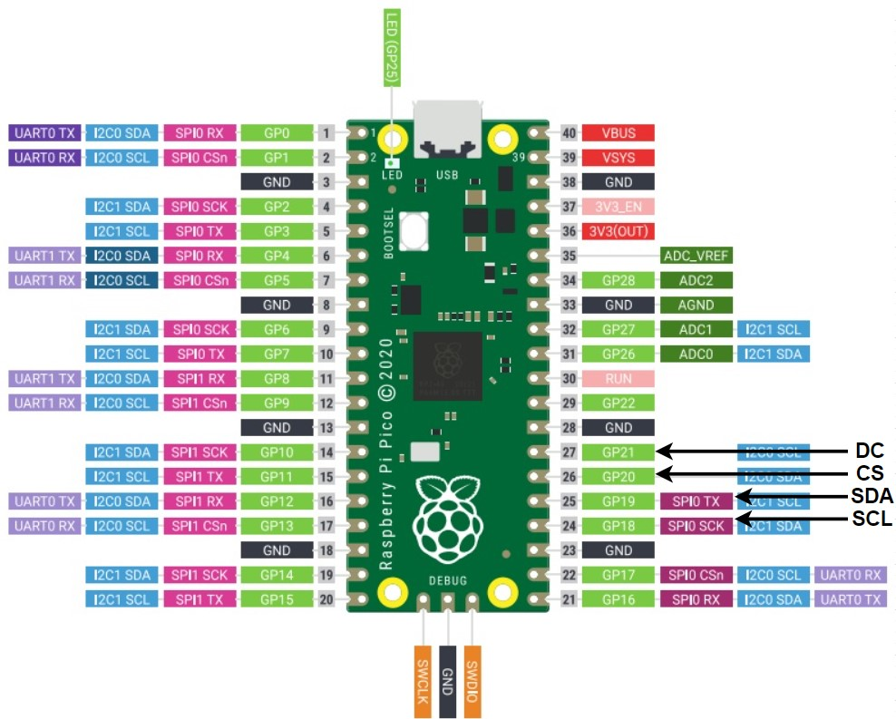

# Pi Pico ST7735 Library
## 1. Overview
This is a successive ST7735 library for Pi Pico.

Text, shapes, and image display.


## 2. Function List
|           Function            |          Introduction           |
| :---------------------------: | :-----------------------------: |
|         void clear()          |       Cover screen black        |
|          void fill()          |   fill screen color you like    |
|     void drawFastHLine()      |    draw fast horizontal line    |
|    void drawFastVertical()    |     draw fast vertical line     |
|        void drawLine()        |  Draw any angle line you want   |
|     void drawRectangle(）     |        Draw a rectangle         |
|   void drawFilledRectanle()   |     Draw a filled rectangle     |
|       void drawCircle()       |          Draw a cicrle          |
|    void drawFilledCircle()    |      Draw a filled circle       |
|        void setFont()         | Set font, adafruit font support |
|       void printChar()        |        print a character        |
|         void print()          |         print a string          |
|       void drawImage()        |          draw an image          |
| uint16_t CRGB(uint32_t color) |   return R5G6B5 16-bit color    |
## 3. Usage
### 3.1 Declear an object

```cpp
#include "ST7735.h"

int main(){
    // SCL, SDA, CS, DC, width, height, frequency,SPI Port
    ST7735 TFT(19, 19, 20, 21, 128, 160, 15000000, spi0);
    return 0;
}
```

You can specify display connection pins, size, frequency, and SPI port. 

The connection between ST7735 and Pi Pico should be like below:

| ST7735 |     Pi Pico     |
| :----: | :-------------: |
|  SCL   |     SPI SCK     |
|  SDA   |     SPI TX      |
|   CS   | Any Pin is fine |
|   DC   | Any pin is fine |

Due to we're using 4-line serial interface, we actually use for pins. Two Pi Pico SPI port(SCK, TX) for ST7735 SCL and SDA and you can use any other pins for CS and DC.



### 3.2 Draw Some Shapes With Color

```cpp
#include "ST7735.h"

// Some useful colors
#define BLACK 0x0000
#define WHITE 0xFFFF
#define RED 0xF800
#define GREEN 0x07E0
#define BLUE 0x001F
#define CYAN 0x07FF
#define MAGENTA 0xF81F
#define YELLOW 0xFFE0

int main(){
    // SCL, SDA, CS, DC, width, height, frequency,SPI Port
    ST7735 TFT(19, 19, 20, 21, 128, 160, 15000000, spi0);
    // Draw a rectangles
    TFT.drawRectangle(0, 50, 128, 20, BLUE);
    TFT.drawFilledRectangle(3, 53, 122, 14, BLUE);
    // Draw circles
    TFT.drawFilledCircle(34, 60, 5, RED);
    TFT.drawFilledCircle(94, 60, 5, RED);
    return 0;
}
```

Like `Function List` above, you can draw some shapes you these functions. What I want to specially talk about is the color.

In ST7735 driver, there are three color mode for us:
- **12-bit/pixel: RGB=(444)**
- **16-bit/pixel: RGB=(565)**
- **18-bit/pixel: RGB=(666)**

What we use if `16-bit/pixel R5G6B5`, so you need this kind of color format to draw shapes, and I define some before main programme.

You may find that there is also a `uint16_t CRGB(uint32_t color)` function that helps you convert 24-bit color to 16-bit color.

And you can use `uint16_t CRGB(uint8_t r, uint8_t g, uint8_t b)` to get 16-bit color too.

### 3.3 Print Text

```cpp
#include "ST7735.h"

int main(){
    // SCL, SDA, CS, DC, width, height, frequency,SPI Port
    ST7735 TFT(19, 19, 20, 21, 128, 160, 15000000, spi0);
    // Print a string
    uint8_t string01[] = "We think you will love these projrcts";
    TFT.print(0, 0, string01, GREEN);
    return 0;
}
```

This Library also support Adafruit Font too, and you can also custom font with `Set Font()` Function.

You can custom your own font through this website [Font Genertor](http://oleddisplay.squix.ch/#/home).

You can modify some characters using this website [Adafruit Font Customiser](https://tchapi.github.io/Adafruit-GFX-Font-Customiser/).


### 3.4 Draw Some Images

```cpp
#include "ST7735.h"
#include "lamp.h

int main(){
    // SCL, SDA, CS, DC, width, height, frequency,SPI Port
    ST7735 TFT(19, 19, 20, 21, 128, 160, 15000000, spi0);
    // Draw an image
    TFT.drawImage(0, 0, 128, 160, lamp);
    return 0;
}
```

Note that you also need to use 16-bit R5G6B5 formate image arrey to display your image.


You can use this software to generate data arrey [LCD Image Converter](https://sourceforge.net/projects/lcd-image-converter/).


And you can watch this Youtube video to learn how to extract image data [How to convert images to Arduino Arrays for use on LCD displays! - Tutorial](https://www.youtube.com/watch?v=Q1iVtLQOZOI&list=PLAmN-pdXdUH1E_IPHQ4pr44oEVrK8XXDe&index=3&t=215s).
